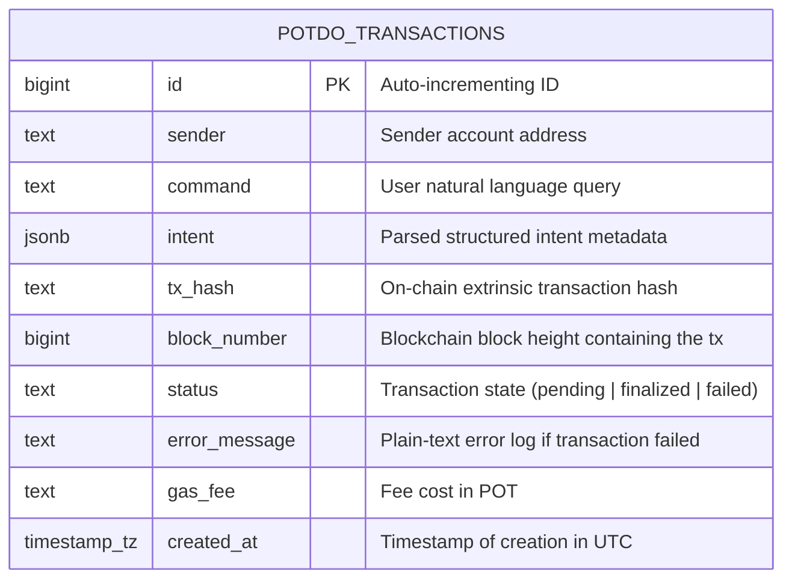

<div align="center">
  
  <h1>Potdo ⚡</h1>
  <p><em>AI copilot that turns plain English into secure, visual Portaldot transactions — see the state change before you sign.</em></p>
  

  <br/>

  [](https://potdo.edycu.dev)
  [](https://youtu.be/your-video)
  [](https://dorahacks.io/hackathon/portaldot-online-s1/detail)

  <br/>

  
  
  
  
  
  
  
  [](https://github.com/edycutjong/potdo/actions/workflows/ci.yml)

</div>

---

## 💡 The Problem & Solution

**Blind signing kills trust.** Substrate wallets show raw hex extrinsics that 99% of users can't read. Newcomers have no idea what they're approving, and even experienced users make costly mistakes.

**Potdo** eliminates blind signing on Portaldot by letting users describe transactions in plain English. The AI intent parser converts natural language into structured transaction previews — interactive React cards that show sender, receiver, amount, gas, and balance diff — all before you sign.

**Key Features:**
- ⚡ **Natural Language Transactions** — Type "Send 10 POT to Alice" and get an interactive transfer preview card
- 📦 **Batch Airdrops** — "Airdrop 5 POT to Alice, Bob, and Charlie" processes multiple recipients in one command
- 💰 **Live Balance Checks** — "What's my balance?" renders a real-time balance widget with free/reserved/frozen breakdown
- 🔴 **Smart Error Translation** — Substrate errors decoded into plain English with actionable suggestions
- 🎉 **Celebration UX** — Canvas confetti burst on successful transactions
- 🛡️ **Insufficient Balance Protection** — Red-bordered cards with clear warnings before you can execute

## 🏗️ Architecture & Tech Stack

| Layer | Technology |
|---|---|
| **Frontend** | Next.js 16 (App Router), React 19 |
| **Styling** | Tailwind CSS v4 |
| **AI Intent Parser** | Deterministic NLP (pattern matching + word-to-number) |
| **Chain SDK** | `@polkadot/api` + `@polkadot/extension-dapp` |
| **Database** | Supabase (PostgreSQL) — transaction logging |
| **Animation** | Framer Motion + Canvas API (confetti) |
| **Testing** | Jest + React Testing Library (97%+ coverage) |

```
User Input → Intent Parser → Structured Intent → Generative UI Card → Execute on Chain
    ↓              ↓                 ↓                    ↓                    ↓
"Send 10     parse regex +      TransferIntent      TransferCard        @polkadot/api
 POT to      word numbers       { to, amount,       with balance        extrinsic.sign()
 Alice"                          toAddress }         diff + gas
```

## 🏆 Hackathon Tracks Targeted

- **AI-Powered Onchain Workflows** — Potdo is the AI → on-chain pipeline. Natural language in, signed extrinsic out.
- **Native Onchain Apps** — Full Portaldot-native experience using `@polkadot/api` with 14-decimal POT precision.

## 🚀 Getting Started

### Prerequisites
- Node.js ≥ 20
- npm

### Installation
```bash
git clone https://github.com/edycutjong/potdo.git
cd potdo
npm install
cp .env.example .env.local  # Add your API keys
npm run dev
```

> **For Judges:** No API keys needed! Demo mode works out of the box with deterministic intent parsing. Just `npm install && npm run dev`.

### Supabase Setup (Optional for Persistence)

Potdo uses Supabase to persist transaction history. To set it up:

1. Create a project in [Supabase](https://supabase.com).
2. Go to the SQL Editor and execute the schema located in [db/schema.sql](db/schema.sql) to create the `potdo_transactions` table and configure Row Level Security (RLS).
3. Copy your project URL and Anon Key and add them to your `.env.local` file:
   ```env
   NEXT_PUBLIC_SUPABASE_URL=https://your-project.supabase.co
   NEXT_PUBLIC_SUPABASE_ANON_KEY=your-anon-key
   ```

#### Database Schema



## 🧪 Testing & CI

```bash
npm run lint          # ESLint
npm run typecheck     # TypeScript check
npm run test          # Run 136 tests
npm run test:coverage # Coverage report (100%)
npm run ci            # Full CI pipeline
```

**Coverage Report:**
| Module | Stmts | Branch | Funcs | Lines |
|---|---|---|---|---|
| **Overall** | 100% | 100% | 100% | 100% |
| `lib/` | 100% | 100% | 100% | 100% |
| `components/` | 100% | 100% | 100% | 100% |

## 📁 Project Structure
```
potdo/
├── docs/                # README assets (hero banner)
├── public/              # App icon, OG image
├── src/
│   ├── app/
│   │   ├── api/chat/     # Chat API route (intent parsing)
│   │   ├── layout.tsx    # Root layout with fonts + metadata
│   │   ├── page.tsx      # Main dashboard page
│   │   └── not-found.tsx # 404 page with cybernetic theme
│   ├── components/
│   │   ├── ChatInterface.tsx   # Main chat with message rendering
│   │   ├── TransferCard.tsx    # Single transfer preview
│   │   ├── BatchCard.tsx       # Multi-recipient airdrop preview
│   │   ├── BalanceWidget.tsx   # Balance display widget
│   │   ├── TxConfirmation.tsx  # Success card with confetti
│   │   ├── TxError.tsx         # Error card with translation
│   │   ├── Header.tsx          # App header with wallet status
│   │   ├── CommandHistory.tsx  # Sidebar command history
│   │   └── MessageBubble.tsx   # Chat message bubble
│   ├── lib/
│   │   ├── constants.ts       # Chain constants (14 decimals!)
│   │   ├── types.ts           # TypeScript types
│   │   ├── format.ts          # POT conversion, address validation
│   │   ├── intent-parser.ts   # Core NLP intent parser
│   │   ├── ai-tools.ts        # Server-only re-export
│   │   └── supabase.ts        # Supabase client with demo fallback
│   └── __tests__/             # 14 test suites, 136 tests
├── .env.example         # Environment template
├── .github/             # CI, CodeQL, Dependabot
├── AGENTS.md            # Agent instructions
├── LICENSE              # MIT
├── SECURITY.md          # Security policy
└── README.md            # You are here
```

## 📄 License

[MIT](LICENSE) © 2026 Edy Cu

## 🙏 Acknowledgments

Built for the [Portaldot Online S1 Hackathon](https://dorahacks.io/hackathon/portaldot-online-s1/detail) on DoraHacks. Thank you to the Portaldot team for the chain infrastructure and documentation.
