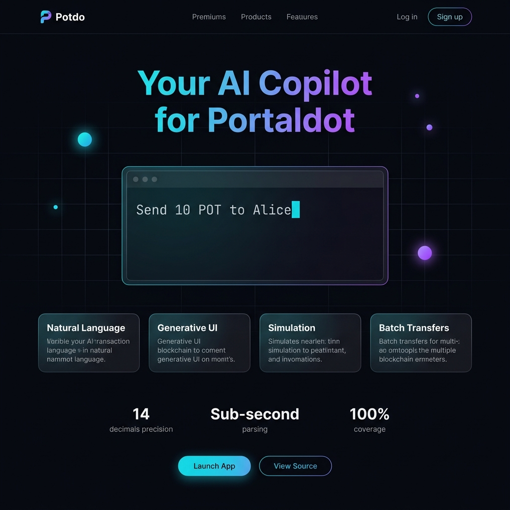
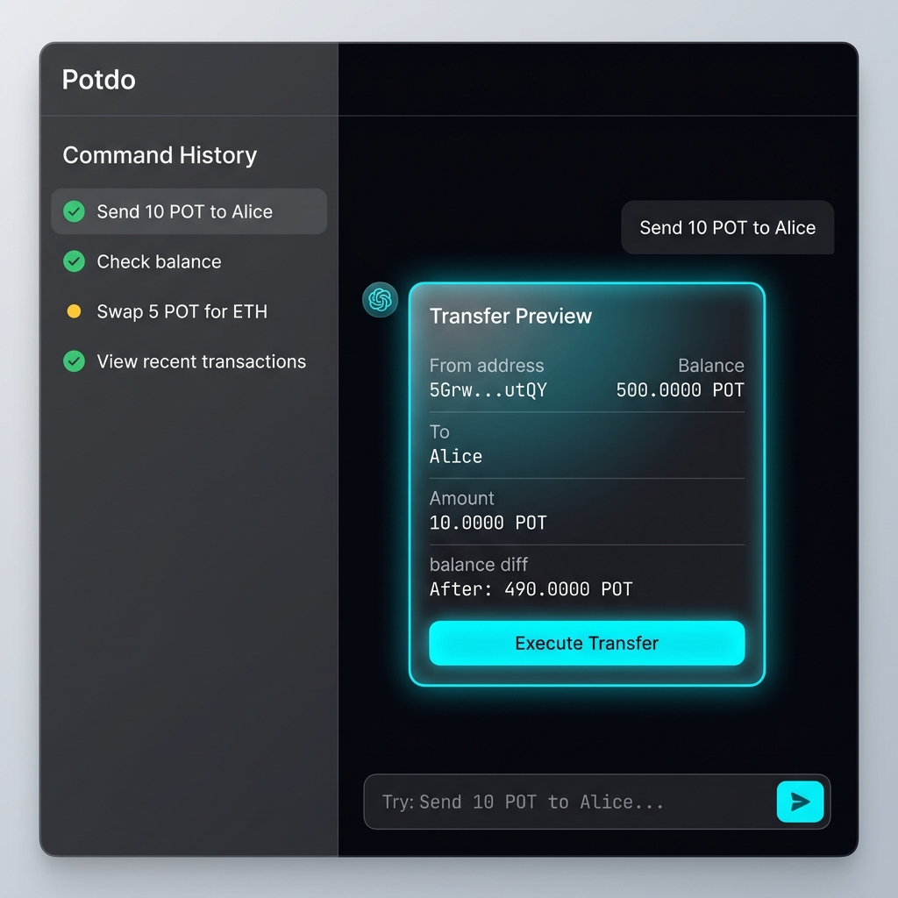
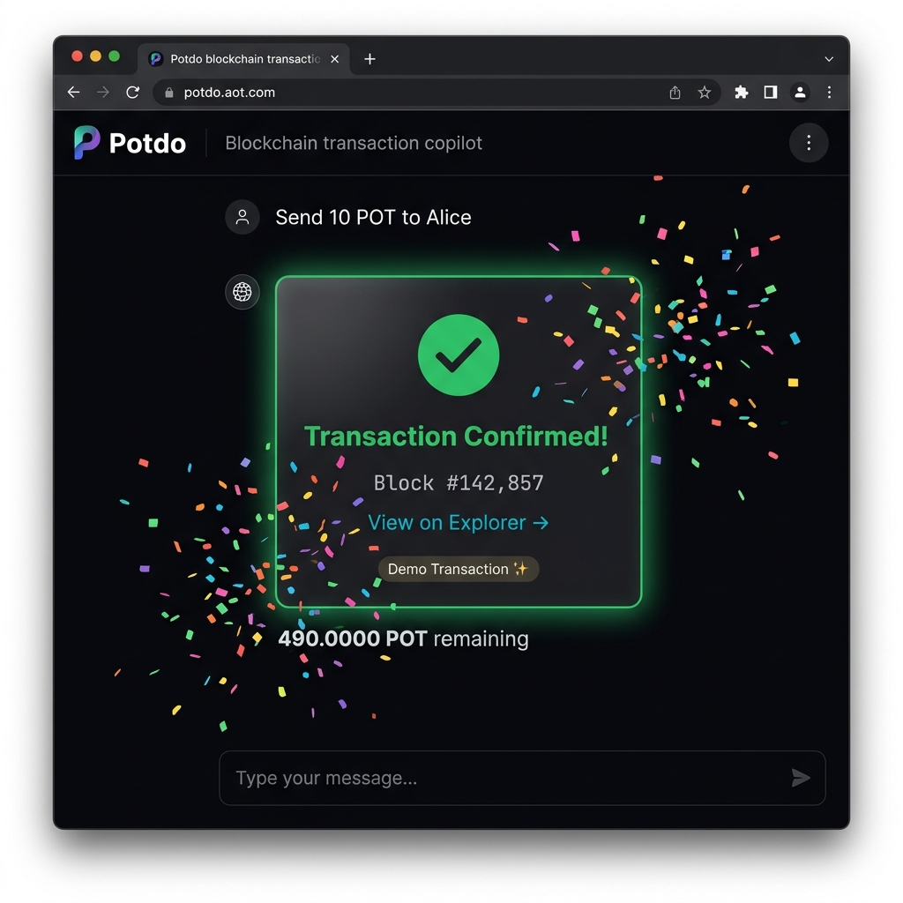
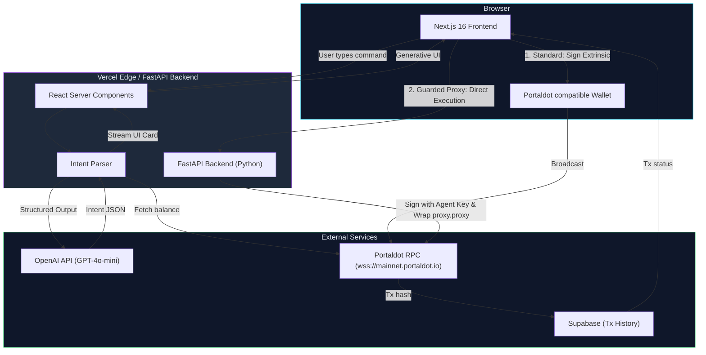
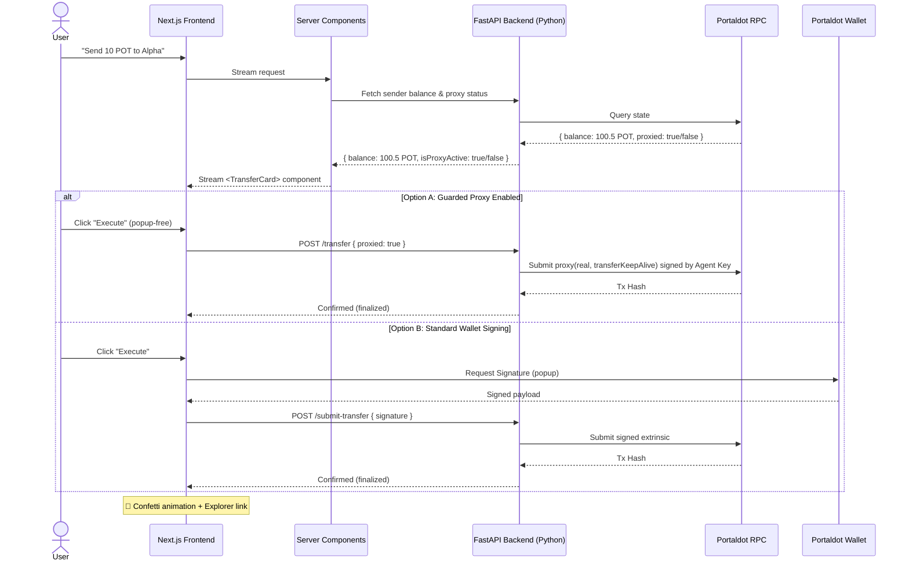
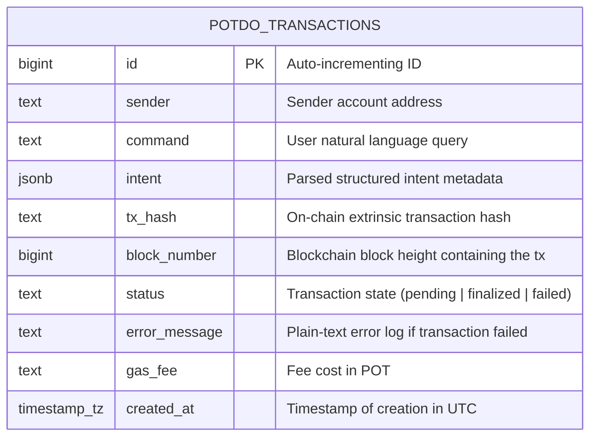

<div align="center">
  
  <h1>Potdo ⚡</h1>
  <p><em>AI copilot that turns plain English into secure, visual Portaldot transactions — see the state change before you sign.</em></p>
  

  <br/>

[](https://potdo.edycu.dev)
[](#)
[](docs/pitch_deck.md)
[](DEMO.md)
[](https://dorahacks.io/hackathon/portaldot-online-s1/detail)

  <br/>


[](https://github.com/edycutjong/potdo/actions/workflows/ci.yml)

</div>

---

## 💡 The Problem & Solution

**Blind signing kills trust.** Substrate wallets show raw hex extrinsics that 99% of users can't read. Newcomers have no idea what they're approving, and even experienced users make costly mistakes.

**Potdo** eliminates blind signing on Portaldot by letting users describe transactions in plain English. The AI intent parser converts natural language into structured transaction previews — interactive React cards that show sender, receiver, amount, gas, and balance diff — all before you sign.

**Key Features:**

- ⚡ **Natural Language Transactions** — Type "Send 10 POT to Alpha" and get an interactive transfer preview card
- 📦 **Batch Airdrops** — "Airdrop 5 POT to Alpha, Beta, and Gamma" processes multiple recipients in one command
- 💰 **Live Balance Checks** — "What's my balance?" renders a real-time balance widget with free/reserved/frozen breakdown
- 🔴 **Smart Error Translation** — Substrate errors decoded into plain English with actionable suggestions
- 🎉 **Celebration UX** — Canvas confetti burst on successful transactions
- 🛡️ **Insufficient Balance Protection** — Red-bordered cards with clear warnings before you can execute
- 🛡️ **Secure Delegation (Guarded AI Proxy)** — Delegate restricted execution authority to the agent. Send transactions instantly without browser wallet signature popups, fully guarded by the Substrate proxy pallet.

## 📸 Screenshots

<div align="center">

### Landing Page



### TransferCard — Generative UI in Action



### Transaction Confirmed 🎉



</div>

## 🏗️ Architecture & Tech Stack

| Layer                | Technology                                                 |
| -------------------- | ---------------------------------------------------------- |
| **Frontend**         | Next.js 16 (App Router), React 19                          |
| **Backend API**      | Python 3.12 (FastAPI), substrate-interface (100% coverage) |
| **Styling**          | Tailwind CSS v4                                            |
| **AI Intent Parser** | Deterministic NLP (pattern matching + word-to-number)      |
| **Chain SDK**        | Portaldot SDK                                              |
| **Database**         | Supabase (PostgreSQL) — transaction logging                |
| **Animation**        | Framer Motion + Canvas API (confetti)                      |
| **Testing**          | Jest + React Testing Library (99.8% coverage)              |

```
User Input → Intent Parser → Structured Intent → Generative UI Card → Execute on Chain
    ↓              ↓                 ↓                    ↓                    ↓
"Send 10     parse regex +      TransferIntent      TransferCard        Portaldot SDK
 POT to      word numbers       { to, amount,       with balance        extrinsic.sign()
 Alice"                          toAddress }         diff + gas
```

## 🏆 Hackathon Tracks Targeted

- **AI-Powered Onchain Workflows** — Potdo is the AI → on-chain pipeline. Natural language in, signed extrinsic out.
- **Native Onchain Apps** — Full Portaldot-native experience using the Portaldot SDK with 14-decimal POT precision.

## ⛓️ Portaldot Native Integration (Sponsor Criteria)

### Thesis

Potdo is architecturally inseparable from Portaldot. Every component is hardwired to Portaldot's Substrate runtime, RPC layer, and native token economics. Removing Portaldot would require a complete rewrite of the entire application.

### Portaldot API Methods Used (12 total)

| #   | Feature                                           | Usage                                    |
| --- | ------------------------------------------------- | ---------------------------------------- |
| 1   | `api.query.system.account(address)`               | Pre-flight balance simulation            |
| 2   | `api.tx.balances.transferKeepAlive(dest, amount)` | Core transfer execution                  |
| 3   | `api.tx.utility.batch([...calls])`                | Multi-recipient batch airdrop            |
| 4   | `tx.signAndSend(account, { signer }, callback)`   | Transaction lifecycle streaming          |
| 5   | Portaldot Wallet SDK                              | Wallet integration                       |
| 6   | WebSocket RPC subscription                        | Live balance updates                     |
| 7   | POT native gas token                              | Every tx pays gas in POT                 |
| 8   | Substrate SS58 address format                     | AI validates against SS58 prefix         |
| 9   | `api.query.proxy.proxies(address)`                | Pre-flight proxy delegation status       |
| 10  | `api.tx.proxy.addProxy(delegate, type, delay)`    | Delegate restricted proxy authority      |
| 11  | `api.tx.proxy.removeProxy(delegate, type, delay)` | Revoke delegated proxy authority         |
| 12  | `api.tx.proxy.proxy(real, force_type, call)`      | Wrap and execute call via proxy delegate |

### Without Portaldot

- **Balance simulation** → Custom API adapter per chain
- **Token transfer** → Different ABI per chain + gas estimation
- **Batch airdrop** → Multicall contract deployment OR sequential txs
- **Wallet signing** → MetaMask OR custom signer per chain
- **Transaction status** → Custom event polling

Take Portaldot out and you'd need 3 separate systems + a bridge layer. Potdo is built for Portaldot from the ground up.

## 📐 Technical Architecture

### System Flow



### Sequence Flow



### 🌐 System Environments & Deployment Tiers

Potdo runs in three distinct environments designed for different phases of the lifecycle:

1. **Demo Mode (In-Memory Simulation)**
   - **Architecture**: **Frontend Only** (pure in-memory browser simulation).
   - **Operation**: All actions (balances, transfers, staking, name updates) are simulated instantly inside React state and persisted to the browser's `localStorage`. No network request to the backend or external RPC is required.
   - **Target Deployment**: Hosted on **Vercel** for instant, zero-setup public testing.

2. **Testnet Mode (Local Dev/Judging)**
   - **Architecture**: **Frontend** + **FastAPI Backend (Python SDK)** + **Local Portaldot Dev Node**.
   - **Operation**: Frontend forwards requests to the FastAPI backend. The backend uses the Portaldot Python SDK (`substrate-interface`) to construct, sign, and submit extrinsics directly to the local dev node running at `ws://127.0.0.1:9944`.
   - **Target Deployment**: Run locally using the preconfigured `Makefile` or Docker compose. The backend can also be hosted on **Railway** pointed to a public VPS chain node.

3. **Mainnet Mode (Production)**
   - **Architecture**: **Frontend** + **FastAPI Backend (Python SDK)** + **Portaldot Mainnet RPC**.
   - **Operation**: Same as Testnet mode, but the backend connects directly to the live production mainnet nodes (e.g. `wss://mainnet.portaldot.io`).
   - **Target Deployment**: Hosted on **Vercel** (Frontend) + **Railway** (Backend API).

---

## 🚀 Getting Started

### Prerequisites

- Node.js ≥ 20
- npm
- Docker (optional, for containerized execution)

### Installation

```bash
git clone https://github.com/edycutjong/potdo.git
cd potdo
make install
```

### 🧑‍⚖️ Judging & Local Verification Guide

To allow a thorough evaluation of all features (including local testnet execution with the Python SDK backend), you can run the entire system locally.

#### Method A: Multi-Terminal Native Run (Recommended)

Open three separate terminal windows/tabs:

1. **Terminal 1: Start the Portaldot Dev Node**

   ```bash
   make testnet
   ```

   _(Launches the local Portaldot testnet node on `ws://127.0.0.1:9944` using the `./testnet/portaldot_dev` binary)._

2. **Terminal 2: Start the FastAPI Python Backend**

   ```bash
   make dev-backend
   ```

   _(Starts the FastAPI server on `http://localhost:8000`, connected directly to the local testnet node)._

3. **Terminal 3: Start the Next.js Web App**
   ```bash
   make dev-frontend
   ```
   _(Starts the UI dev server on `http://localhost:3000` with hot reloading)._

#### Method B: One-Command Docker Compose Run

If you have Docker installed, you can spin up all three services in containerized mode with a single command:

```bash
make docker-up
```

- **Verify status**: `make docker-logs` to watch live node block production and server requests.
- **Stop services**: `make docker-down` to clean up.

### Supabase Setup (Optional for Persistence)

Potdo uses Supabase to persist transaction history. To set it up:

1. Create a project in [Supabase](https://supabase.com).
2. Go to the SQL Editor and execute the schema located in [db/schema.sql](db/schema.sql) to create the `potdo_transactions` table and configure Row Level Security (RLS).
3. Copy your project URL and Anon Key and add them to your `.env.local` file:
   ```env
   NEXT_PUBLIC_SUPABASE_URL=https://your-project.supabase.co
   NEXT_PUBLIC_SUPABASE_ANON_KEY=your-anon-key
   ```

#### Database Schema



## 📊 Demo & Seed Data

For a seamless demonstration, the application is pre-configured with canonical Substrate development accounts.

### Named Accounts (Address Book)

| Name            | Purpose                                     | Pre-funded POT | Address                                                         |
| --------------- | ------------------------------------------- | -------------- | --------------------------------------------------------------- |
| **Demo Wallet** | The sender (connected via Portaldot Wallet) | 1000 POT       | `5GrwvaEF5zXb26Fz9rcQpDWS57CtERHpNehXCPcNoHGKutQY` (Alice Seed) |
| **Alice**       | Primary recipient for single transfers      | 10 POT         | `5GrwvaEF5zXb26Fz9rcQpDWS57CtERHpNehXCPcNoHGKutQY`              |
| **Bob**         | Batch transfer recipient #2                 | 5 POT          | `5FHneW46xGXgs5mUiveU4sbTyGBzmstUspZC92UhjJM694ty`              |
| **Charlie**     | Batch transfer recipient #3                 | 0 POT          | `5FLSigC9HGRKVhB9FiEo4Y3koPsNmBmLJbpXg2mp1hXcS59Y`              |
| **Dave**        | Error validation demonstration target       | 0 POT          | `5DAAnrj7VHTznn2AWBemMuyBwZWs6FNFjdyVXUeYUM3aUNew`              |

### Core Demo Scenarios

1. **Single Transfer Flow**: _"Send 10 POT to Alpha"_
   - Checks sender balance (1000 POT) -> streams `<TransferCard>` showing post-transaction balance simulation (990 POT) -> click **Execute** to sign and finalize.
2. **Batch Airdrop Flow**: _"Airdrop 5 POT to Alpha, Beta, and Gamma"_
   - Parses multiple recipients -> streams `<BatchCard>` showing a table of transfers -> click **Execute Batch** to sign and submit a single `utility.batch` extrinsic.
3. **Error Protection**: _"Send 5000 POT to Delta"_
   - Checks sender balance (1000 POT) -> streams `<TransferCard>` with a **red warning** of insufficient funds -> blocks wallet popup to prevent gas waste.

## 🧪 Testing & CI

```bash
npm run lint          # ESLint
npm run typecheck     # TypeScript check
npm run test          # Run 282 tests
npm run test:coverage # Coverage report (99.8%)
npm run ci            # Full CI pipeline
```

**Coverage Report:**
| Module | Stmts | Branch | Funcs | Lines |
|---|---|---|---|---|
| **Overall** | 99.81% | 99.60% | 100% | 100% |
| `lib/` | 100% | 100% | 100% | 100% |
| `components/` | 99.70% | 99.42% | 100% | 100% |

## 📁 Project Structure

```
potdo/
├── docs/                # README assets (hero banner)
├── public/              # App icon, OG image
├── src/
│   ├── app/
│   │   ├── api/chat/     # Chat API route (intent parsing)
│   │   ├── layout.tsx    # Root layout with fonts + metadata
│   │   ├── page.tsx      # Main dashboard page
│   │   └── not-found.tsx # 404 page with cybernetic theme
│   ├── components/
│   │   ├── ChatInterface.tsx   # Main chat with message rendering
│   │   ├── TransferCard.tsx    # Single transfer preview
│   │   ├── BatchCard.tsx       # Multi-recipient airdrop preview
│   │   ├── BalanceWidget.tsx   # Balance display widget
│   │   ├── TxConfirmation.tsx  # Success card with confetti
│   │   ├── TxError.tsx         # Error card with translation
│   │   ├── Header.tsx          # App header with wallet status
│   │   ├── CommandHistory.tsx  # Sidebar command history
│   │   └── MessageBubble.tsx   # Chat message bubble
│   ├── lib/
│   │   ├── constants.ts       # Chain constants (14 decimals!)
│   │   ├── types.ts           # TypeScript types
│   │   ├── format.ts          # POT conversion, address validation
│   │   ├── intent-parser.ts   # Core NLP intent parser
│   │   ├── ai-tools.ts        # Server-only re-export
│   │   └── supabase.ts        # Supabase client with demo fallback
│   └── __tests__/             # 24 test suites, 282 tests
├── .env.example         # Environment template
├── .github/             # CI, CodeQL, Dependabot
├── AGENTS.md            # Agent instructions
├── DEMO.md              # Step-by-step demo walkthrough for judges
├── LICENSE              # MIT
├── SECURITY.md          # Security policy
├── scripts/             # Verification scripts
└── README.md            # You are here
```

## ⚡ Portaldot Integration Depth

Potdo is architecturally inseparable from Portaldot. Every component is hardwired to Portaldot's Substrate runtime, RPC layer, and native token economics.

| #   | Portaldot API                                     | Usage in Potdo                   |
| --- | ------------------------------------------------- | -------------------------------- |
| 1   | `api.query.system.account(address)`               | Pre-flight balance simulation    |
| 2   | `api.tx.balances.transferKeepAlive(dest, amount)` | Core transfer execution          |
| 3   | `api.tx.utility.batch([...calls])`                | Multi-recipient batch airdrop    |
| 4   | `tx.signAndSend(account, { signer }, callback)`   | Transaction lifecycle streaming  |
| 5   | Portaldot Wallet SDK                              | Wallet integration               |
| 6   | WebSocket RPC subscription                        | Live balance updates             |
| 7   | POT native gas token (14 decimals)                | Every tx pays gas in POT         |
| 8   | Substrate SS58 address format                     | AI validates against SS58 prefix |

> Remove Portaldot and Potdo ceases to function. No fallback, no abstraction layer. This is a **Portaldot-native** application.

## 🪞 Honest Limitations

We believe transparency builds trust — especially in a hackathon:

1. **No custom ink! contracts** — MVP uses only native pallets (`balances`, `utility`, `system`). Deliberate choice for demo reliability over complexity.
2. **RPC endpoint dependency** — Demo depends on a working Portaldot RPC (`wss://mainnet.portaldot.io`). Fallback: demo mode with deterministic mock data.
3. **AI is pattern matching (demo mode)** — Without an OpenAI API key, the intent parser uses deterministic word-to-number NLP rather than LLM inference. This is _honest_ — the demo should work without external dependencies.
4. **POT token acquisition unresolved** — No public faucet or exchange listing exists. On-chain transactions require organizer-provided tokens.

## 📄 License

[MIT](LICENSE) © 2026 Edy Cu

## 🙏 Acknowledgments

Built for the [Portaldot Online S1 Hackathon](https://dorahacks.io/hackathon/portaldot-online-s1/detail) on DoraHacks. Thank you to the Portaldot team for the chain infrastructure and documentation.
